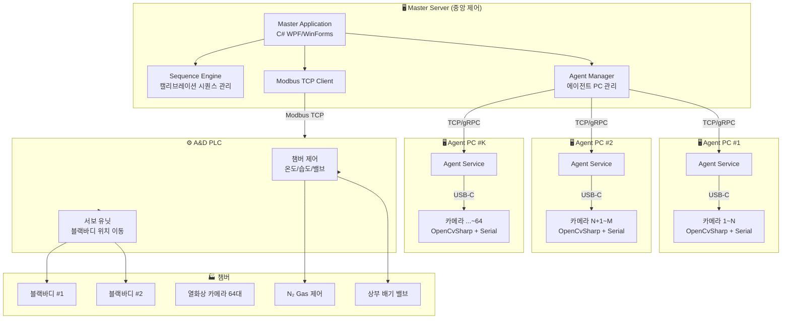
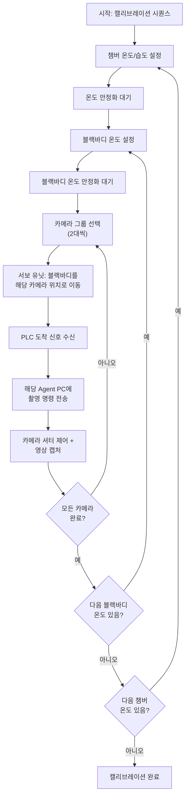

# Temperature Calibration Chamber 열화상 카메라 캘리브레이션 시스템

## 1. 프로젝트 개요

64대의 열화상 카메라를 챔버 내부에서 블랙바디(2개)를 이용해 순차 캘리브레이션하는 시스템.
A&D PLC가 챔버(온도·습도)와 서보 유닛을 물리적으로 제어하며, 우리 소프트웨어(여우별 소프트)가 Modbus TCP를 통해 PLC에 명령을 전달한다.

---

## 2. 시스템 구성도



---

## 3. 하드웨어 구성 및 제약사항

### 3.1 열화상 카메라 (64대)

| 항목 | 상세 |
|------|------|
| 연결 방식 | USB-C (UVC 영상 + 가상 시리얼 포트) |
| 영상 수신 | OpenCvSharp (`VideoCapture`) |
| 시리얼 제어 | 셔터 개폐, 펌웨어 정보 R/W |
| PC당 카메라 수 | **8~16대 권장** (USB 대역폭 기준) |

> [!IMPORTANT]
> **PC당 연결 가능 카메라 수는 카메라 해상도/프레임레이트 확정 후 실측이 필요합니다.**
> - USB 3.0 호스트 컨트롤러 1개 = 5Gbps 공유
> - 160×120 @ 9Hz → PC당 16대 이상 가능
> - 640×480 @ 30Hz → PC당 4~8대 수준
> - 가상 시리얼 포트 수도 OS 한계 고려 필요 (COM 포트 최대 256개)

### 3.2 멀티 PC 구성 추정

| 시나리오 | PC 수 | PC당 카메라 |
|----------|--------|-------------|
| 저해상도 (160×120) | 4대 | 16대 |
| 중해상도 (320×240) | 8대 | 8대 |
| 고해상도 (640×480) | 16대 | 4대 |

### 3.3 A&D PLC (Modbus TCP)

| 항목 | 상세 |
|------|------|
| 프로토콜 | Modbus TCP |
| 제어 대상 | 챔버 (온도/습도/밸브), 서보 유닛 (위치 이동) |
| 통신 주체 | Master Server만 PLC와 통신 |

### 3.4 블랙바디 (2개)

| 항목 | 상세 |
|------|------|
| 용도 | 캘리브레이션 기준 온도 소스 |
| 위치 이동 | PLC 서보 유닛이 카메라 위치로 이동 |
| 동시 촬영 | 최대 2대 (블랙바디 1개당 카메라 1대) |
| 캘리브레이션 사이클 | 64대 ÷ 2 = **32회 반복** |

> [!WARNING]
> **블랙바디 연동 프로토콜이 아직 미확인입니다.** 블랙바디 제조사/모델, 통신 프로토콜(시리얼? Modbus? Ethernet?), 온도 설정/읽기 명령 등의 확인이 필요합니다.

---

## 4. 소프트웨어 아키텍처

### 4.1 전체 구조: Master-Agent 분산 아키텍처

```
┌─────────────────────────────────────────────────────────┐
│                    Master Server                         │
│  ┌──────────┐ ┌──────────┐ ┌───────────┐ ┌───────────┐ │
│  │ UI Layer │ │ Sequence │ │  Modbus   │ │  Agent    │ │
│  │ (WPF)    │ │ Engine   │ │  Manager  │ │  Manager  │ │
│  └──────────┘ └──────────┘ └───────────┘ └───────────┘ │
│  ┌──────────┐ ┌──────────┐ ┌───────────┐               │
│  │ BlackBody│ │  Data    │ │   Log     │               │
│  │ Manager  │ │ Storage  │ │  Manager  │               │
│  └──────────┘ └──────────┘ └───────────┘               │
└─────────────────────────────────────────────────────────┘
        │ Modbus TCP        │ TCP/gRPC
        ▼                   ▼
   ┌─────────┐    ┌──────────────────┐
   │ A&D PLC │    │  Agent PC (×N)   │
   │         │    │ ┌──────────────┐ │
   │ 챔버제어 │    │ │ Camera Mgr   │ │
   │ 서보제어 │    │ │ Serial Ctrl  │ │
   │         │    │ │ Image Store  │ │
   │         │    │ └──────────────┘ │
   └─────────┘    └──────────────────┘
```

### 4.2 솔루션 프로젝트 구조

```
HeatingCameraSystem.sln
│
├── src/
│   ├── HeatingCameraSystem.Core/          # 공통 라이브러리
│   │   ├── Models/                        # 데이터 모델 (카메라, 챔버, 블랙바디)
│   │   ├── Protocols/                     # 통신 프로토콜 정의
│   │   │   ├── Modbus/                    # Modbus TCP 클라이언트
│   │   │   ├── Serial/                    # 시리얼 통신 (카메라 제어)
│   │   │   └── AgentComm/                 # Master↔Agent 통신 (gRPC/TCP)
│   │   ├── Enums/
│   │   └── Interfaces/
│   │
│   ├── HeatingCameraSystem.Master/        # 마스터 서버 (WPF)
│   │   ├── ViewModels/
│   │   ├── Views/
│   │   ├── Services/
│   │   │   ├── SequenceEngine/            # 캘리브레이션 시퀀스 관리
│   │   │   ├── ChamberController/         # 챔버 온도/습도 제어
│   │   │   ├── ServoController/           # 서보 유닛 (블랙바디 위치) 제어
│   │   │   ├── BlackBodyController/       # 블랙바디 온도 제어
│   │   │   ├── AgentOrchestrator/         # 에이전트 PC 오케스트레이션
│   │   │   └── SafetyManager/             # 비상 정지, 안전 인터록
│   │   └── Configuration/
│   │
│   ├── HeatingCameraSystem.Agent/         # 에이전트 PC 서비스
│   │   ├── Services/
│   │   │   ├── CameraManager/             # OpenCvSharp 카메라 관리
│   │   │   ├── SerialController/          # 가상 시리얼 포트 제어
│   │   │   ├── ImageProcessor/            # 이미지 캡처/저장
│   │   │   └── AgentService/              # 마스터와 통신
│   │   └── Configuration/
│   │
│   └── HeatingCameraSystem.BlackBody/     # 블랙바디 연동 (프로토콜 확인 후)
│       ├── Drivers/
│       └── Interfaces/
│
├── tests/
│   ├── HeatingCameraSystem.Core.Tests/
│   ├── HeatingCameraSystem.Master.Tests/
│   └── HeatingCameraSystem.Agent.Tests/
│
└── docs/
    └── 260522 회의록_V_01.pdf
```

### 4.3 주요 NuGet 패키지

| 패키지 | 용도 |
|--------|------|
| `OpenCvSharp4` + `OpenCvSharp4.runtime.win` | 카메라 영상 수신 |
| `System.IO.Ports` | 가상 시리얼 포트 통신 |
| `NModbus4` 또는 `FluentModbus` | Modbus TCP 통신 |
| `Grpc.Net.Client` / `Grpc.AspNetCore` | Master↔Agent gRPC 통신 |
| `Serilog` | 구조화 로깅 |
| `Microsoft.Extensions.DependencyInjection` | DI 컨테이너 |
| `CommunityToolkit.Mvvm` | WPF MVVM 지원 |

---

## 5. 핵심 기능 상세

### 5.1 챔버 제어 (Modbus TCP → PLC)

```
Master → [Modbus TCP] → A&D PLC → 챔버
```

| 기능 | Modbus 동작 | 비고 |
|------|------------|------|
| 운전/정지 | Write Coil / Register | 프로그램 컨트롤러 제어 |
| 온도 설정/읽기 | Read/Write Holding Register | 설정온도, 현재온도 |
| 습도 읽기 | Read Input Register | 챔버 내부 습도 |
| N₂ Gas 제어 | Write Register | 비례 제어 (습도 기반) |
| 배기 밸브 | Write Coil | 과습 시 OPEN/CLOSE |
| 비상 정지 | Write Coil | 히터·냉동기·부하 OFF |

> [!NOTE]
> **습도 제어 로직 (회의록 기반)**:
> 1. 챔버 시작 시 → 내부 습도 모니터링 → 설정값 초과 시 N₂ Gas 투입
> 2. 상부 배기 밸브: 과습 설정값(%) 이상 시에만 OPEN → 설정값 도달 후 CLOSE
> 3. 온도 상승 구간 → 습도 제어 미동작 (결로 위험 없음)
> 4. 온도 하강 구간 → 습도 설정값 초과 시 N₂ Gas 비례 제어

### 5.2 서보 유닛 제어 (블랙바디 위치 이동)

```
Master → [Modbus TCP] → PLC → 서보 유닛 → 블랙바디 이동
```

| 기능 | 상세 |
|------|------|
| 위치 명령 | 카메라 번호(1~64) → PLC에 위치값 전달 |
| 이동 상태 | PLC에서 시작/도착 신호 수신 |
| 비상 정지 | 서보 전원 차단, 해제 시 위치 기억 보존 |

### 5.3 캘리브레이션 시퀀스



### 5.4 Master ↔ Agent 통신 (gRPC)

```protobuf
// 예시 gRPC 서비스 정의
service AgentService {
    // 에이전트 상태 조회
    rpc GetStatus(StatusRequest) returns (AgentStatus);
    
    // 카메라 목록 조회
    rpc GetCameras(CameraListRequest) returns (CameraListResponse);
    
    // 촬영 명령
    rpc CaptureImage(CaptureRequest) returns (CaptureResponse);
    
    // 셔터 제어
    rpc ControlShutter(ShutterRequest) returns (ShutterResponse);
    
    // 펌웨어 정보
    rpc GetFirmwareInfo(FirmwareRequest) returns (FirmwareResponse);
    
    // 실시간 영상 스트리밍
    rpc StreamVideo(StreamRequest) returns (stream VideoFrame);
}
```

---

## 6. 안전 기능 (Safety)

| 항목 | 동작 |
|------|------|
| **비상 정지 (E-Stop)** | 히터·냉동기·부하 OFF, 서보 전원 차단 |
| **비상 정지 해제** | 서보 위치 기억 보존, 수동 확인 후 재시작 |
| **과습 보호** | 배기 밸브 자동 OPEN (설정값 초과 시) |
| **통신 단절** | Agent PC 하트비트 모니터링, 단절 시 알람 |
| **온도 이상** | 챔버/블랙바디 온도 범위 초과 시 자동 정지 |

---

## 7. Open Questions (사용자 확인 필요)

> [!IMPORTANT]
> ### Q1. 블랙바디 연동
> 블랙바디 제조사/모델명과 통신 프로토콜은 무엇인가요?
> - 시리얼(RS-232/485)? Modbus? Ethernet?
> - 온도 설정/읽기 명령 프로토콜?
> - PLC 경유인지, 별도 직접 연결인지?

> [!IMPORTANT]
> ### Q2. A&D PLC Modbus 레지스터 맵
> PLC의 Modbus 레지스터 맵(주소표)을 확보할 수 있나요?
> - 챔버 온도/습도 제어 레지스터 주소
> - 서보 유닛 위치 명령/상태 레지스터 주소
> - 비상 정지 레지스터 주소
> - PLC IP 주소 및 포트

> [!IMPORTANT]
> ### Q3. 열화상 카메라 시리얼 프로토콜
> 카메라 가상 시리얼 포트의 통신 프로토콜 문서가 있나요?
> - 보드레이트, 데이터 비트, 패리티 등
> - 셔터 제어 명령 포맷
> - 펌웨어 읽기/쓰기 명령 포맷

> [!WARNING]
> ### Q4. 데이터 저장
> 캡처된 열화상 이미지의 저장 방식은?
> - 각 Agent PC 로컬 저장 후 마스터로 전송?
> - 네트워크 스토리지(NAS) 공유?
> - 이미지 포맷 (raw 열 데이터? 16bit TIFF? 온도 맵?)

> [!NOTE]
> ### Q5. UI 요구사항
> 마스터 서버의 UI에서 보여줘야 할 핵심 화면은?
> - 64대 카메라 실시간 모니터링?
> - 챔버 온도/습도 트렌드 그래프?
> - 캘리브레이션 진행 상황 대시보드?

---

## 8. Verification Plan

### Automated Tests
```bash
dotnet test tests/HeatingCameraSystem.Core.Tests/
dotnet test tests/HeatingCameraSystem.Master.Tests/
dotnet test tests/HeatingCameraSystem.Agent.Tests/
```

### Manual Verification
- 단일 카메라 연결 → 영상 수신 + 시리얼 통신 테스트
- Modbus TCP 시뮬레이터로 PLC 통신 검증
- Agent PC 1대 → Master 연결 테스트
- 점진적 카메라 수 증가 (4 → 8 → 16) 안정성 확인

---

## 9. 개발 단계 (Phase)

| Phase | 내용 | 기간(추정) |
|-------|------|-----------|
| **Phase 1** | Core 라이브러리 + 단일 PC 카메라 1대 연동 | 2주 |
| **Phase 2** | Modbus TCP (챔버/서보) 연동 | 2주 |
| **Phase 3** | Master-Agent 분산 구조 구현 | 3주 |
| **Phase 4** | 블랙바디 연동 + 캘리브레이션 시퀀스 | 2주 |
| **Phase 5** | UI (대시보드, 모니터링) | 3주 |
| **Phase 6** | 64대 풀 연동 + 안정화 | 2주 |
