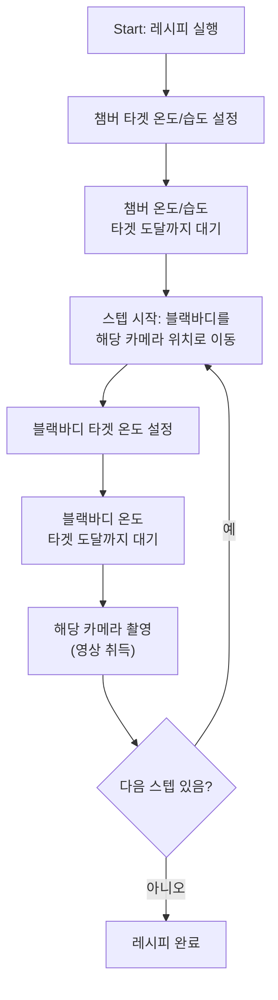

# UI 요구사항 정의서

> 대상: 열화상 카메라 모니터링 & 레시피 기반 촬영 시스템
> 상태: 요구사항 수집 단계 (구현 전)
> 변경점: **캘리브레이션 시퀀스 폐기** → 레시피 기반 블랙바디 이동 + 영상 취득으로 전환

---

## 1. 화면 구성 개요

| 화면 | 목적 |
|------|------|
| 메인 대시보드 | 실시간 영상 + 온습도 + 레시피 실행 |
| 레시피 편집 화면 | 레시피 등록/편집/수정/삭제 |
| 카메라-위치 매핑 화면 | 어느 카메라가 어느 위치에 있는지 설정 |
| 히스토리 화면 | 온도/습도/이미지 검색·조회 |

---

## 2. 메인 대시보드

### 2.1 레이아웃
```
┌─────────────────────────────────┬──────────────┐
│                                 │  카메라 리스트 │
│   좌측 상단: 영상 뷰              │  (드래그 소스) │
│   (View Mode 1~5)               │              │
│                                 │  ─────────── │
├─────────────────────────────────┤  Start 버튼   │
│   좌측 하단: 온도/습도 차트        │  (레시피 실행) │
└─────────────────────────────────┴──────────────┘
```

- 영상 업데이트 주기: **1초 간격**
- 우측 카메라 리스트 → 영상 뷰로 **드래그앤드롭**으로 배치
- 카메라 리스트는 **Agent PC별 그룹**으로 표시 (PC 단위로 묶어서 카메라 나열)
- 온도/습도 차트: **챔버 1대** 기준 (단일 소스)

### 2.2 View Modes

| Mode | 표시 수 | 동작 |
|------|--------|------|
| **1** | 최대 8개 | **전체 카메라 자동 순환** — 연결된 카메라 수 기준 페이지 분할, 1초 간격 페이지 전환 |
| **2** | 8개 | 드래그앤드롭 등록한 카메라만 |
| **3** | 4개 | 드래그앤드롭 등록한 카메라만 |
| **4** | 2개 | 드래그앤드롭 등록한 카메라만 |
| **5** | 1개 | 드래그앤드롭 등록한 카메라만 |

#### Mode 1 순환 규칙 (적응형)
- **연결된 카메라 수를 확인**하여 페이지 구성
- 페이지당 최대 8개, 1초 간격으로 페이지 전환
- 예시:
  - 연결 64대 → 8페이지 → 한 카메라는 8초마다 1번 노출
  - 연결 8대 → 1페이지 (순환 없음, 항상 표시)
  - 연결 4대 → 1페이지 → 1초마다 갱신 (페이지 전환 불필요)
- 즉, 페이지 수 = `ceil(연결카메라수 / 8)`

### 2.3 Start 버튼 (레시피 실행)
- 선택된 레시피대로 실행 시작
- 실행 흐름은 4장 참조

---

## 3. 레시피

### 3.1 개념
레시피 = **블랙바디 이동 순서 + 영상 취득 시퀀스** 정의

- 모터가 **블랙바디를 이동** → 해당 포지션에서 매핑된 카메라로 촬영
- 여러 레시피 **등록 / 편집 / 수정 / 삭제** 가능

### 3.2 레시피 구조

| 범위 | 항목 |
|------|------|
| **레시피 전체 (1개)** | 타겟 챔버 온도, 타겟 챔버 습도 |
| **스텝마다** | 이동할 카메라(위치), 타겟 블랙바디 온도 |

- 스텝 = 카메라 1개 (= 블랙바디 이동 위치 1개)
- 스텝 순서: 사용자가 **드래그앤드롭 / 순서 지정**으로 정렬

### 3.3 실행 흐름



> **대기 규칙**: 타겟 온도/습도가 설정된 경우, **도달할 때까지 대기 후** 다음 동작(이동/촬영) 진행.

### 3.4 블랙바디 운용 / 촬영 모드

- 블랙바디 **2개** 역할 구분:
  - **촬영용 바디** — 카메라 영상 취득 기준
  - **웜업용 바디** — 다음 카메라 미리 예열(warm-up)
- **기본: 1개씩 순차 촬영** (한 카메라씩)
- **동시 촬영은 옵션** — 활성화 시 최대 2대 동시 (블랙바디 2개 동시 사용)

---

## 4. 카메라-위치 매핑 화면

- **64개 고정 위치**가 UI에 시각적으로 그려져 있음
- 우측 카메라 리스트 → 각 위치 공간으로 **드래그앤드롭**으로 배치
- 레시피의 "카메라 이동" = 이 매핑된 위치로 블랙바디(서보) 이동
- 매핑 정보 저장 위치는 8장(데이터 저장) 참조

---

## 5. 히스토리 화면

### 검색 조건
- 날짜 / 시간
- 카메라 번호
- ~~온도 범위~~ (**제외**)

### 표시
- 온도 / 습도 / 카메라 이미지 목록
- **이미지 클릭 시 팝업**으로 확대 표시

---

## 6. 시스템 구조 (확정)

- **Master-Agent 분산 구조 유지** — 여러 대의 PC에 카메라가 분산 연결될 확률이 높음
- 64대 카메라가 다수 Agent PC에 분산
- PLC Modbus TCP 통신은 Master만 담당 (기존 계획서 유지)

---

## 7. 데이터 저장

### 7.1 저장 위치
- **Agent PC + Master PC 양쪽**에 저장
- 저장 경로(위치): **사용자가 지정**

### 7.2 이미지 포맷
- **옵션으로 선택 가능** (포맷 후보 확정 필요 — raw/TIFF 등)

### 7.3 보존 정책 (Retention)
- **Agent PC**: 사용자가 지정한 **날짜 이후 자동 삭제** 기능 필요
- **Master PC**: 사용자 옵션 — **무한 보존** 또는 **지정일 이후 삭제** 선택

### 7.4 매핑/설정 저장
- 카메라-위치 매핑 정보 → Agent PC + Master PC에 사용자가 지정한 위치에 저장

---

## 8. 확정된 제외 사항
- ❌ 캘리브레이션 시퀀스 (기존 implementation_plan.md 5.3 폐기)
- ❌ 히스토리 온도 범위 검색
- ❌ 회의록 PDF 반영 불필요

---

## 9. 잔여 확인 사항

| # | 항목 | 상태 |
|---|------|------|
| 1 | 이미지 포맷 (raw 열데이터 / 16bit TIFF / 온도맵 등) | **사용자가 나중에 선택** |
